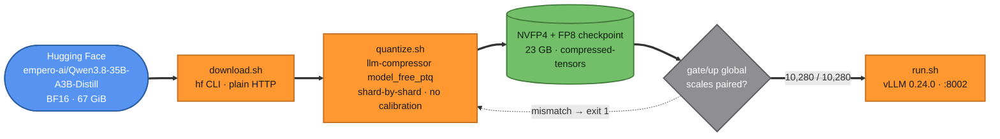
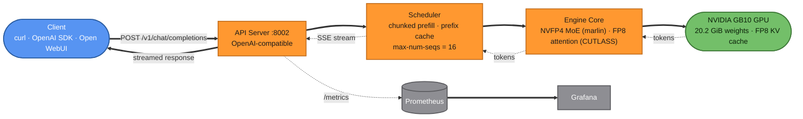
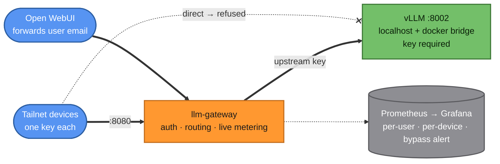
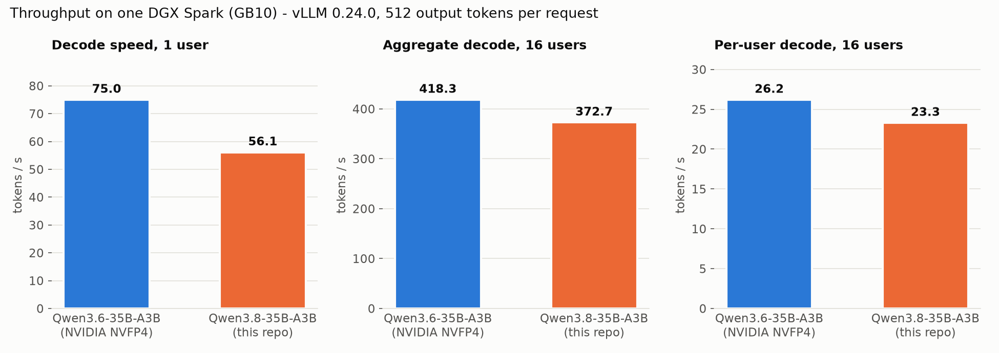
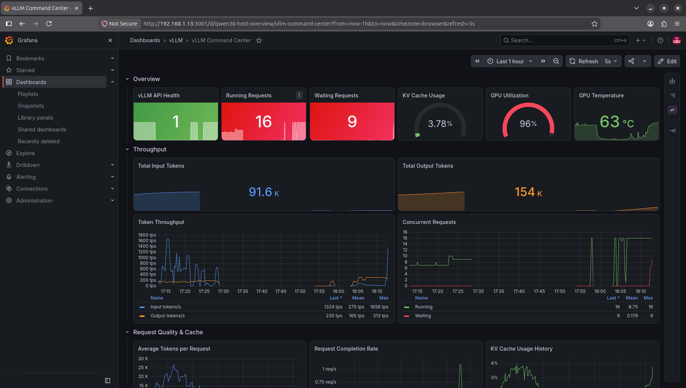

<div align="center">


# Qwen3.8-35B-A3B (NVFP4 + FP8) on NVIDIA DGX Spark (GB10)

**Download, quantize and serve a 4-bit Qwen3.8 MoE on one GPU: 16 concurrent users, 262K context, 373 tok/s aggregate**

[](https://huggingface.co/empero-ai/Qwen3.8-35B-A3B-Distill)
[](#quantization-recipe)
[](https://github.com/vllm-project/vllm)
[-76B900)](https://www.nvidia.com/en-us/products/workstations/dgx-spark/)
[](https://www.apache.org/licenses/LICENSE-2.0)
[](#configuration-reference)

</div>

---

## Overview

This repository contains the full pipeline used to run
[**`empero-ai/Qwen3.8-35B-A3B-Distill`**](https://huggingface.co/empero-ai/Qwen3.8-35B-A3B-Distill)
on a single **NVIDIA DGX Spark (GB10, Blackwell, 128GB unified memory)**. The model is a
35B-total / 3B-active Mixture-of-Experts model, and the pipeline goes from the BF16 download to a
**4-bit NVFP4 + FP8** checkpoint served by vLLM with tool calling and reasoning parsing.

> [!IMPORTANT]
> **Qwen has not released an official "Qwen3.8 A3B".** Its Qwen3.8 releases are `Qwen3.8-27B`
> (dense), `Qwen3.8-Flash-Next` and `Qwen3.8-2.4T-A95B`. This model is a **community
> distillation** by [Empero](https://empero.org): `Qwen/Qwen3.6-35B-A3B` fine-tuned on reasoning
> traces from the Qwen3.8 frontier models. It keeps the Qwen3.6 architecture, which is why it
> runs with exactly the same vLLM configuration as the
> [Qwen3.6 production deployment](https://github.com/Hitheshkaranth/Qwen-3_6_Model_DGX_Spark_Setup).

No pre-quantized checkpoint of this model existed for vLLM, so this repo builds one. It follows
NVIDIA's own recipe for the Qwen3.6 base, but needs **no calibration data**: it streams one shard
at a time and runs in about 20 minutes using a few GB of memory. It works around two quantizer
problems that would otherwise silently cost accuracy or stop vLLM from starting (see
[Quantization Recipe](#quantization-recipe)).

> Every number in this README was measured on the deployment itself; none are projected or
> estimated. See [`docs/ENGINEERING.md`](docs/ENGINEERING.md) for the full methodology, logs
> and raw data.

## Table of Contents

- [Architecture](#architecture)
- [Hardware & Software Requirements](#hardware--software-requirements)
- [Quick Start](#quick-start)
- [Manual Setup — Step by Step](#manual-setup--step-by-step)
- [Quantization Recipe](#quantization-recipe)
  - [How the quantization works](#how-the-quantization-works)
- [Configuration Reference](#configuration-reference)
- [Hosting on This System](#hosting-on-this-system)
- [Metering Gateway & Tailscale](#metering-gateway--tailscale)
- [Benchmarks](#benchmarks)
  - [Throughput vs. Qwen3.6](#throughput-vs-qwen36)
  - [Under Load: Grafana During the Benchmark](#under-load-grafana-during-the-benchmark)
  - [Reasoning & Output Length](#reasoning--output-length)
  - [Published Scores](#published-scores)
- [Live Monitoring](#live-monitoring)
- [Client Usage](#client-usage)
- [Repository Layout](#repository-layout)
- [Troubleshooting](#troubleshooting)
- [Credits & License](#credits--license)

---

## Architecture

### Build pipeline



### Request flow



## Hardware & Software Requirements

| Component | Requirement | Notes |
|---|---|---|
| GPU | 1x NVIDIA Blackwell GPU (SM ≥ 12.0) | Tested on **DGX Spark (GB10)**, compute capability 12.1 |
| Memory | ≥ 32GB GPU-addressable memory | Weights take 20.2 GiB; GB10's 128GB is unified CPU+GPU memory |
| Driver | NVIDIA driver with CUDA 13.x support | `580.173.02` used here |
| OS | Linux (aarch64 or x86_64) | Ubuntu 24.04.4, kernel 6.17.0-1031-nvidia |
| Docker | Docker Engine + NVIDIA Container Toolkit | Docker 29.2.1; `--gpus all` must work |
| NGC | Pull access to `nvcr.io/nvidia/vllm:26.07-py3` | `docker login nvcr.io` if needed |
| Disk | ~95GB free | 67 GiB BF16 source + 23 GB quantized output |
| Network | Outbound HTTPS to huggingface.co | ~71 GB download on first run |

## Quick Start

**One line**, on any single-Blackwell-GPU box with Docker and the NVIDIA Container Toolkit
already set up:

```bash
curl -fsSL https://raw.githubusercontent.com/Hitheshkaranth/Qwen-3_8_A3B_Model_DGX_Spark_Setup/main/install.sh | bash
```

The script checks prerequisites, clones the repo, downloads the model, quantizes it and starts
the server. Each step skips work that's already done, so it's safe to re-run if it stops partway.

Prefer to clone it yourself first? Same result:

```bash
git clone https://github.com/Hitheshkaranth/Qwen-3_8_A3B_Model_DGX_Spark_Setup.git && cd Qwen-3_8_A3B_Model_DGX_Spark_Setup
./download.sh && ./quantize.sh && ./run.sh
```

> [!WARNING]
> On GB10, run **one** 0.70-utilization vLLM server at a time. If another model is already
> serving (for example the Qwen3.6 container on `:8000`), stop it first: `docker stop vllm`.

## Manual Setup — Step by Step

**1. Confirm the GPU is visible to Docker**

```bash
docker run --rm --gpus all nvidia/cuda:12.6.0-base-ubuntu22.04 nvidia-smi
```

**2. Download the BF16 checkpoint (~71 GB)**

```bash
./download.sh
```

Files go to `models/Qwen3.8-35B-A3B-Distill/`. The script uses plain HTTP
(`HF_HUB_DISABLE_XET=1`) because Hugging Face Xet transfers stalled at 0 bytes on this machine.
Interrupted downloads resume.

**3. Build the serving image**

```bash
docker build -t vllm-qwen38-a3b:local .
```

This starts from `nvcr.io/nvidia/vllm:26.07-py3` and applies one patch: upgrading `xgrammar` to
`0.2.4`. The base image pins `0.2.0`, which lacks `normalize_tool_choice`, so every request
that includes `tools` returns 500 without the patch. See the [`Dockerfile`](Dockerfile).

**4. Quantize (~20 minutes)**

```bash
./quantize.sh
sudo chown -R "$USER": models/Qwen3.8-35B-A3B-Distill-NVFP4   # the container writes as root
```

This builds a throwaway image ([`Dockerfile.quant`](Dockerfile.quant): serving image +
`llmcompressor==0.14.0`) and runs [`quantize.py`](quantize.py), writing
`models/Qwen3.8-35B-A3B-Distill-NVFP4/` (23 GB). At the end it checks every fused gate/up pair
and prints:

```
gate/up global-scale pairs checked: 10280, mismatched: 0
```

**5. Run the container**

This is exactly what `run.sh` does, and it is the command this deployment runs:

```bash
docker run -d \
  --name vllm-qwen38-a3b \
  --restart unless-stopped \
  --gpus all \
  --ipc host \
  -p 8002:8000 \
  -v "$PWD/models/Qwen3.8-35B-A3B-Distill-NVFP4":/models/qwen3.8-35b-a3b:ro \
  vllm-qwen38-a3b:local \
  python3 -m vllm.entrypoints.openai.api_server \
    --model /models/qwen3.8-35b-a3b \
    --served-model-name qwen3.8-35b-a3b \
    --gpu-memory-utilization 0.70 \
    --max-model-len 262144 \
    --max-num-seqs 16 \
    --max-num-batched-tokens 8192 \
    --enable-prefix-caching \
    --kv-cache-dtype fp8 \
    --moe-backend marlin \
    --language-model-only \
    --reasoning-parser qwen3 \
    --enable-auto-tool-choice \
    --tool-call-parser qwen3_coder \
    --host 0.0.0.0 \
    --port 8000
```

Unlike the Qwen3.6 deployment, which pulls weights from Hugging Face into a named volume, this
server loads the **locally quantized checkpoint** from a read-only bind mount. It never contacts
Hugging Face at runtime. Or use the wrapper:

```bash
./run.sh                 # same as above, http://localhost:8002
PORT=8000 ./run.sh       # publish on another host port
RESTART=no ./run.sh      # don't auto-restart (useful while testing)
```

**6. Watch it come up**

```bash
docker logs -f vllm-qwen38-a3b
```

Startup takes **about 4–5 minutes** (258 s measured): about 2 minutes of weight loading, then
`torch.compile`, kernel autotuning and CUDA graph capture. It's ready when you see:

```
INFO:     Application startup complete.
```

**7. Verify it's serving**

```bash
curl http://localhost:8002/v1/models

curl http://localhost:8002/v1/chat/completions \
  -H "Content-Type: application/json" \
  -d '{"model":"qwen3.8-35b-a3b","messages":[{"role":"user","content":"Say OK."}],"max_tokens":512}'
```

## Quantization Recipe

The layout follows [`nvidia/Qwen3.6-35B-A3B-NVFP4`](https://huggingface.co/nvidia/Qwen3.6-35B-A3B-NVFP4),
adapted so it needs no calibration data:

| Module | Format | vs. NVIDIA's Qwen3.6 build |
|---|---|---|
| Routed experts `mlp.experts.N.{gate,up,down}_proj` | **NVFP4 W4A16**, group 16 | Same |
| Shared expert `mlp.shared_expert.{gate,up,down}_proj` | **NVFP4 W4A16**, group 16 | Same |
| Full attention `self_attn.{q,k,v,o}_proj` | **FP8 W8A8**, per-channel, **dynamic** activations | NVIDIA: static (calibrated) activations |
| Linear attention `linear_attn.{in_proj_qkv,in_proj_z,out_proj}` | **FP8 W8A8**, dynamic | NVIDIA: static |
| `lm_head` | **BF16** | NVIDIA: NVFP4 (costs speed, see [Benchmarks](#benchmarks)) |
| Embeddings, routers, `shared_expert_gate`, `in_proj_a/b`, `conv1d`, norms, MTP head | BF16 | Same |
| KV cache | FP8 at runtime | Same |

### How the quantization works

**Where the weights go.** In this model, 32.2B of the 35B parameters are routed-expert weights
(40 layers × 256 experts × 3 projections × 512 × 2048). Those, plus the shared expert, are
compressed to 4 bits. The attention projections, which are small but used on every token, get
8 bits. Everything that is tiny or numerically sensitive stays in BF16.

**NVFP4 (experts).** Each weight is a 4-bit float (E2M1: values ±{0, 0.5, 1, 1.5, 2, 3, 4, 6}).
Every block of 16 consecutive weights shares one FP8 (E4M3) scale, and each whole tensor has one
FP32 global scale that stretches the FP8 range. The stored tensors for one expert's `gate_proj`
(512 × 2048) are:

| Tensor | dtype | Shape | Contents |
|---|---|---|---|
| `weight_packed` | U8 | 512 × 1024 | two 4-bit values per byte |
| `weight_scale` | F8_E4M3 | 512 × 128 | one scale per 16 weights |
| `weight_global_scale` | F32 | 1 | tensor-wide scale (**shared with the paired `up_proj`**) |

That works out to about 4.5 bits per weight. At runtime, vLLM's **Marlin** kernel unpacks the
4-bit weights to BF16 inside the GEMM ("W4A16"), so activations stay in BF16. This means GB10
doesn't need FP4 tensor-core activations.

**FP8 (attention).** Weights are E4M3 with one BF16 scale per output row
(`weight` F8_E4M3 8192 × 2048 + `weight_scale` 8192 × 1 for `q_proj`). Activations are quantized
**dynamically per token** at runtime, so no calibration statistics are needed. vLLM runs these
through `CutlassFP8ScaledMMLinearKernel`.

**Streaming, no calibration** (`llmcompressor.model_free_ptq`):

```
for each of the 22 safetensors shards (1.7–6.7 GB each), 2 at a time on the GPU:
    load shard (+ any gate/up partner tensors held in another shard)
    split fused 3D experts.gate_up_proj -> experts.N.gate_proj / experts.N.up_proj
    NVFP4: shared global scale per gate/up pair -> per-16 FP8 scales -> pack 2 per byte
    FP8:   per-row absmax -> E4M3 weight + scale
    write the compressed shard; copy everything else through unchanged
write config.json quantization_config + model.safetensors.index.json
verify: every gate/up weight_global_scale pair is identical
```

Peak memory is a few GB, which is why it ran next to a live 85 GB vLLM server.

<details>
<summary><b>The <code>quantization_config</code> vLLM reads</b> (from the checkpoint's <code>config.json</code>)</summary>

```json
{
  "format": "mixed-precision",
  "quantization_status": "compressed",
  "config_groups": {
    "group_0": {
      "format": "nvfp4-pack-quantized",
      "targets": [
        "re:^(?!mtp\\.).*layers\\.\\d+\\.mlp\\.experts\\.\\d+\\.(gate|up|down)_proj$",
        "re:^(?!mtp\\.).*layers\\.\\d+\\.mlp\\.shared_expert\\.(gate|up|down)_proj$"
      ],
      "weights": { "num_bits": 4, "type": "float", "strategy": "tensor_group",
                   "group_size": 16, "scale_dtype": "torch.float8_e4m3fn", "symmetric": true },
      "input_activations": null
    },
    "group_1": {
      "format": "float-quantized",
      "targets": [
        "re:^(?!mtp\\.).*layers\\.\\d+\\.self_attn\\.(q|k|v|o)_proj$",
        "re:^(?!mtp\\.).*layers\\.\\d+\\.linear_attn\\.(in_proj_qkv|in_proj_z|out_proj)$"
      ],
      "weights": { "num_bits": 8, "type": "float", "strategy": "channel", "symmetric": true },
      "input_activations": { "num_bits": 8, "type": "float", "strategy": "token", "dynamic": true }
    }
  },
  "ignore": ["lm_head", "re:.*embed_tokens.*", "re:.*mlp\\.gate$", "re:.*shared_expert_gate.*",
             "re:.*in_proj_(a|b)$", "re:.*conv1d.*", "re:.*norm.*", "re:^mtp\\..*", "re:.*visual.*"]
}
```

</details>

**Two quantizer problems this repo works around** (details in
[`docs/ENGINEERING.md §3`](docs/ENGINEERING.md#3-quantization)):

1. **Unpaired gate/up scales.** llm-compressor only shares an NVFP4 global scale between names
   that look like `mlp.gate_proj`/`mlp.up_proj`. vLLM fuses gate and up, and keeps only gate's
   scale, so every expert's `up_proj` would be scaled wrong without a warning. `quantize.py`
   registers the `experts.N.*` and `shared_expert.*` pairs and verifies all 10,280 of them.
2. **Target regexes vLLM can't see.** vLLM matches quantization targets against its own module
   names (`model.layers.N…`) and doesn't remap `re:` patterns. With targets anchored to the
   Hugging Face names, the experts look unquantized and startup fails with
   `moe_backend='marlin' is not supported for unquantized MoE`. The targets are written to match
   both naming styles.

## Configuration Reference

These are the same flags as the Qwen3.6 production server, all tuned on this GB10 machine. Full
rationale is in [`docs/ENGINEERING.md`](docs/ENGINEERING.md).

| Flag | Value | Why |
|---|---|---|
| `--gpu-memory-utilization` | `0.70` | On this unified-memory machine, higher values made concurrency collapse under load. Treated as a hard ceiling. |
| `--max-model-len` | `262144` | The model's native maximum context (`max_position_embeddings`). |
| `--max-num-seqs` | `16` | Target number of concurrent users. The KV cache alone would allow 23 full-length requests. |
| `--max-num-batched-tokens` | `8192` | Keeps prefill batching efficient under concurrent load (the model's published GB10 recipe value). |
| `--enable-prefix-caching` | on | Reuses KV for shared system prompts and multi-turn chats. |
| `--kv-cache-dtype` | `fp8` | Halves KV memory versus BF16: 6.05M tokens of cache. |
| `--moe-backend` | `marlin` | NVFP4 W4A16 MoE kernel validated on GB10 (SM 12.1). |
| `--language-model-only` | on | Skips the vision tower, which the distill didn't fine-tune. |
| `--served-model-name` | `qwen3.8-35b-a3b` | The name clients put in `"model"`. |
| `--reasoning-parser` | `qwen3` | Moves the `<think>` block into `message.reasoning` instead of the answer. |
| `--enable-auto-tool-choice` / `--tool-call-parser` | `qwen3_coder` | OpenAI-style function calling (verified). |

Recommended sampling (from the model card): `temperature=0.6, top_p=0.95, top_k=20`. Every answer
starts with a reasoning block, so allow a generous `max_tokens` (16,384 recommended).

## Hosting on This System

This is how the model is hosted on the DGX Spark alongside the existing Qwen3.6 production
server and monitoring stack.

### Services on the box

| Port | Container | What it is |
|---|---|---|
| `8000` | `vllm` | Qwen3.6-35B-A3B-NVFP4 production server ([its repo](https://github.com/Hitheshkaranth/Qwen-3_6_Model_DGX_Spark_Setup)) |
| **`8002`** | **`vllm-qwen38-a3b`** | **This server**: Qwen3.8-35B-A3B, model name `qwen3.8-35b-a3b` (localhost + docker bridge only) |
| `8080` | `llm-gateway` (systemd) | Metering gateway: the only client entry point; per-user/per-client token metrics |
| `3001` | `vllm-grafana` | Grafana dashboards (vLLM Command Center) |
| `9090` | `vllm-prometheus` | Prometheus, scraping `:8000` and `:8002` in the `vllm` job |
| `9400` | `vllm-dcgm-exporter` | GPU metrics (utilization, temperature, memory) |
| `9100` | `vllm-node-exporter` | Host CPU / RAM metrics |

**On this box, clients don't call vLLM directly.** vLLM is published only on `127.0.0.1` and the
docker bridge (`BIND_ADDRS="127.0.0.1 172.17.0.1" ./run.sh`), and every client uses a
**metering gateway** on `:8080`: `http://<spark-host>:8080/v1` with a per-user or per-app API key.
The gateway routes each request to whichever vLLM server serves the requested model, and records
tokens per user and client, live while responses stream. Open WebUI forwards each end user's
email, so its chats are attributed per person. Grafana's "Per-User Usage (current model)"
section reads from the gateway, and a *Gateway Coverage* tile flags any traffic that bypasses it.

| Path | Reachable from | Used by |
|---|---|---|
| `:8080` gateway | LAN + Tailscale | Open WebUI, opencode, scripts (API key required) |
| `127.0.0.1:8002` | this host only | the gateway |
| `172.17.0.1:8002` | docker bridge only | Prometheus (`/metrics`) |

Without a gateway, run `./run.sh` with the default `BIND_ADDRS=0.0.0.0`. vLLM itself has no API
key, so keep it on a private network.

### Memory budget (121 GiB unified)

| Item | Size |
|---|---:|
| vLLM allocation (`--gpu-memory-utilization 0.70`) | ~85 GiB |
| of which model weights | 20.23 GiB |
| of which FP8 KV cache | 6,049,171 tokens (23.1 full 262K-context requests) |
| Left for the OS, monitoring stack and page cache | ~36 GiB |

Two 0.70 servers can't be resident at once, so **Qwen3.6 and Qwen3.8 take turns** on this box.

### Switching models

```bash
# Qwen3.6 -> Qwen3.8
docker stop vllm && docker update --restart no vllm
docker update --restart unless-stopped vllm-qwen38-a3b && docker start vllm-qwen38-a3b   # ready in ~4.5 min

# Qwen3.8 -> Qwen3.6
docker stop vllm-qwen38-a3b && docker update --restart no vllm-qwen38-a3b
docker update --restart unless-stopped vllm && docker start vllm                         # ready in ~6 min
```

Use `docker stop`/`start` (not `rm`) so each container keeps its exact flags. Requests in flight
on the stopped server are dropped. Only the active container keeps `unless-stopped`, so a reboot
never brings both up at once. Clients need no change when you swap: the gateway finds the new
model within 10 seconds.

### Files on disk

```
models/Qwen3.8-35B-A3B-Distill/        67 GiB  BF16 source (can be deleted after quantizing)
models/Qwen3.8-35B-A3B-Distill-NVFP4/  23 GB   served checkpoint, mounted read-only into the container
```

## Metering Gateway & Tailscale

Every client, whether Open WebUI, opencode or scripts on laptops across the tailnet, reaches the
model through a small **metering gateway** on `:8080`. It attributes each request to a user,
device or app, and counts tokens live. vLLM itself is locked so nothing can go around it.



```bash
./gateway/setup.sh                                                        # 1. install the gateway (systemd user service, :8080)
VLLM_API_KEY=$(cat gateway/upstream.key) BIND_ADDRS="127.0.0.1 172.17.0.1" ./run.sh   # 2. lock vLLM behind it
cd gateway && venv/bin/python tailscale_keys.py && systemctl --user restart llm-gateway  # 3. one key per tailnet device
```

Clients then use `http://<server-tailscale-ip-or-name>:8080/v1` with their own key.

| What | Where |
|---|---|
| Full setup, client configs (opencode, Open WebUI, SDK), Tailscale (per-device keys, tailnet-only binding, HTTPS via `tailscale serve`, ACLs), operations, troubleshooting | **[`docs/GATEWAY.md`](docs/GATEWAY.md)** |
| Gateway code and helpers | [`gateway/`](gateway/) |
| Prometheus scrape snippet, Grafana dashboard, bypass alert | [`monitoring/`](monitoring/) |

Input tokens are counted when a request starts (exact count via vLLM `/tokenize`). Output tokens
are counted as they stream, or on completion for non-streaming calls. Keys, the upstream secret
and the usage database are generated locally and never committed.

## Benchmarks

Both models ran on the same box, one at a time, with identical flags and prompts. Scripts and
raw results are in [`benchmarks/`](benchmarks/).

### Throughput vs. Qwen3.6



| Metric | Qwen3.6-35B-A3B (NVIDIA NVFP4) | **Qwen3.8-35B-A3B (this repo)** |
|---|---:|---:|
| Decode, 1 user | 75.0 tok/s | 56.1 tok/s |
| Decode, 16 users (aggregate) | 418.3 tok/s | 372.7 tok/s |
| Decode, 16 users (per user) | 26.2 tok/s | 23.3 tok/s |
| Checkpoint size | 21.8 GB | 23 GB (20.23 GiB loaded) |
| KV cache (fp8) | 5.90M tokens | 6.05M tokens |
| Max concurrency at 262K context | 22.5x | 23.1x |
| Cold start to ready | ~6 min | 258 s |
| Tool calling | ✅ | ✅ |

This build decodes 25% slower at 1 user and 11% slower at 16 users. The likely main cause is
the **BF16 `lm_head`**, which reads about 1 GB per generated token, compared with about 0.26 GB
for NVIDIA's NVFP4 `lm_head`. This hasn't been measured separately. The gap shrinks with more users because the whole batch shares each `lm_head` read.
Quantizing `lm_head` is the first item in [open items](docs/ENGINEERING.md#7-known-limitations--open-items).

Method: every request generates exactly 512 tokens (`ignore_eos`), after one warm-up request
([`throughput_bench.py`](benchmarks/throughput_bench.py) ·
[`throughput_result.json`](benchmarks/throughput_result.json)).

### Under Load: Grafana During the Benchmark

Screenshot of the live Grafana dashboard at 18:13 on 2026-09-23, taken while the reasoning
benchmark below ran against this server:



| Panel | Reading | What it shows |
|---|---|---|
| Running / Waiting requests | **16** / 9 | The `--max-num-seqs 16` limit is saturated; extra requests wait in the queue |
| GPU utilization | **96%** | The GB10 is fully busy decoding |
| KV cache usage | **3.78%** | 16 reasoning requests use a small fraction of the 6.05M-token cache, so memory is not the limit |
| GPU temperature | 63 °C | Sustained load |
| Token throughput (right edge) | ~230 output tok/s, up to 1.6K input tok/s | Mixed prefill + decode on long reasoning traces |

The earlier traffic on the left of the time-series panels (17:15–17:35) is the Qwen3.6
production server's normal workload before it was stopped for this test. The Qwen3.8 load starts
at about 17:58.

### Reasoning & Output Length

Measured on this deployment on 2026-09-23 with the model card's thinking-mode sampling
(`temperature=0.6, top_p=0.95, top_k=20`) and 16 requests in flight:

| Test | Qwen3.8-35B-A3B (this repo) | Qwen3.6-35B-A3B (NVIDIA NVFP4) |
|---|---:|---:|
| **GSM8K**, first 100 test problems | **99%** (99/100) | *pending* |
| avg / max output tokens | 303 / 1,251 | |
| hit the 16,384-token limit | 0 | |
| **MATH-500**, first 100 with integer answers | **94%** (94/100) | *pending* |
| avg / max output tokens | 2,263 / 16,384 | |
| hit the 16,384-token limit | 6 | |
| **Long-form**, 4 prompts, 32,768-token cap | avg **20,723** tokens | *pending* |
| per prompt: API guide / 10k-word story / computing history / chess engine | 29,714 / 32,768 (cap) / 3,727 / 16,683 | |

What the numbers show:

- **Grade-school math is essentially solved**, with very short reasoning: 303 tokens on average.
- **On harder math it scores 94%.** Six problems used the entire 16,384-token budget. The
  6 misses are consistent with those truncations, but the answers weren't saved, so this isn't
  confirmed. Qwen recommends 32,768 tokens (81,920 for competition math), so a larger
  `max_tokens` would likely recover some.
- **It still writes long outputs when asked.** The model card warns that training on examples
  of at most 8,192 tokens makes outputs shorter, yet three of four long-form prompts produced
  16k–33k tokens, and one filled the 32,768 cap. The generated text wasn't saved, so how good
  those long outputs are wasn't checked.
- The Qwen3.6 column will be filled in by running the same script against the Qwen3.6 server.
  That needs Qwen3.8 stopped, because only one model fits in memory at a time.

Raw results: [`reasoning_result_qwen38.json`](benchmarks/reasoning_result_qwen38.json) ·
script: [`reasoning_bench.py`](benchmarks/reasoning_bench.py). Wall times in the JSON may include
other traffic on the server and aren't a throughput measure. Use the throughput benchmark above
for speed.

### Published Scores

No official scores exist for a Qwen3.8 A3B. The closest published references:

**Empero's evaluation of this distill vs. its base** (lm-evaluation-harness, zero-shot, BF16):

| Task | Qwen3.6-35B-A3B | Qwen3.8-35B-A3B-Distill | Δ |
|---|---:|---:|---:|
| MMLU | 83.8 | 83.4 | −0.4 (within noise) |
| ARC-Challenge (acc_norm) | 54.8 | **59.1** | **+4.4** |
| ARC-Easy (acc_norm) | 71.7 | **76.6** | **+4.8** |

**Qwen's official model cards**, for context:

| Benchmark | Qwen3.6-35B-A3B (base of this distill) | Qwen3.8-27B (dense, official) |
|---|---:|---:|
| GPQA (Diamond) | 86.0 | 89.2 |
| HLE | 21.4 | 30.8 |
| LiveCodeBench v6 | 80.4 | 90.3 |
| AIME26 | 92.7 | — |
| MMLU-Pro | 85.2 | — |
| SWE-bench Verified / Pro | 73.4 / 49.5 | — / 61.7 |
| Terminal-Bench | 51.5 (v2.0) | 73.0 (v2.1) |
| **Recommended max output** | 32,768 (81,920 for competition math) | 262,144 reasoning + 131,072 answer |

The distill was trained on examples of at most **8,192 tokens**, so it produces shorter outputs
than its base, and long-form or long-context work may suffer. The long-form test above measures
this directly.

## Live Monitoring

A live capture of the dashboard under benchmark load is shown in
[Under Load: Grafana During the Benchmark](#under-load-grafana-during-the-benchmark).

The server exposes Prometheus metrics at `/metrics`. On this machine it's scraped in the same
`vllm` job as the Qwen3.6 server, and the Grafana dashboard separates the two by the
`model_name` label (`qwen3.8-35b-a3b`):

```yaml
scrape_configs:
  - job_name: vllm
    static_configs:
      - targets: ["host.docker.internal:8000", "host.docker.internal:8002"]
```

If `prometheus.yml` is bind-mounted as a single file, run `docker restart <prometheus>` after
editing it. A SIGHUP won't pick up a file replaced by `sed -i`.

## Client Usage

```python
from openai import OpenAI

client = OpenAI(api_key="EMPTY", base_url="http://localhost:8002/v1")

resp = client.chat.completions.create(
    model="qwen3.8-35b-a3b",
    messages=[{"role": "user", "content": "A snail climbs 3 m a day and slips 2 m a night in a 10 m well. How many days?"}],
    max_tokens=16384,
    temperature=0.6, top_p=0.95,
    extra_body={"top_k": 20},
)
print(resp.choices[0].message.reasoning)   # the <think> trace
print(resp.choices[0].message.content)     # the answer: 8
```

To disable the thinking block for faster, direct answers:

```python
resp = client.chat.completions.create(
    model="qwen3.8-35b-a3b",
    messages=[{"role": "user", "content": "Say OK."}],
    extra_body={"chat_template_kwargs": {"enable_thinking": False}},
)
```

## Repository Layout

```
Qwen-3_8_A3B_Model_DGX_Spark_Setup/
├── README.md                        # this file
├── install.sh                       # one-line installer (curl | bash)
├── Dockerfile                       # nvcr vLLM 26.07 base + xgrammar patch
├── Dockerfile.quant                 # serving image + llm-compressor (quantization only)
├── download.sh                      # step 1: BF16 weights from Hugging Face
├── quantize.sh                      # step 2: runs quantize.py in the container
├── quantize.py                      #   NVFP4/FP8 recipe + gate/up pairing fix + verification
├── run.sh                           # step 3: build + run the vLLM server on :8002
├── gateway/                         # metering gateway (see docs/GATEWAY.md)
│   ├── gateway.py                   #   auth · routing · live token metering · /metrics
│   ├── setup.sh                     #   venv + upstream key + systemd user service
│   ├── add_key.py                   #   issue a key for a user/app
│   ├── tailscale_keys.py            #   one key per tailnet device (+ CSV to hand out)
│   └── keys.example.json            #   key file format (real keys.json is git-ignored)
├── monitoring/
│   ├── prometheus-scrape.yml        # vllm + llm-gateway scrape jobs
│   ├── grafana-dashboard.json       # vLLM Command Center (per-user/per-device panels)
│   └── gateway-bypass-alert.yml     # Grafana alert: traffic bypassing the gateway
├── benchmarks/
│   ├── throughput_bench.py          # decode tok/s at N concurrent users
│   ├── throughput_result.json       # raw results cited above
│   ├── throughput_comparison.png    # chart
│   ├── reasoning_bench.py           # GSM8K / MATH-500 accuracy + long-form length
│   ├── reasoning_result_qwen38.json # raw reasoning results cited above
│   └── make_charts.py               # renders the PNGs from the JSON results
├── assets/
│   └── grafana-dashboard-qwen38.png # live dashboard under benchmark load
└── docs/
    ├── ENGINEERING.md               # full engineering log & raw data
    └── GATEWAY.md                   # metering gateway + Tailscale: setup, clients, ops
```

`models/` (the downloaded and quantized weights, ~90 GB) is git-ignored and Docker-ignored.

## Troubleshooting

| Symptom | Fix |
|---|---|
| `moe_backend='marlin' is not supported for unquantized MoE` | The checkpoint's quantization targets don't match vLLM's module names. Re-run `./quantize.sh` from this repo, which writes unanchored `re:^(?!mtp\.).*layers…` targets. |
| Log shows `w1_weight_global_scale must match w3_weight_global_scale` | The checkpoint was quantized without the gate/up pairing fix, and accuracy is degraded. Re-quantize with this repo's `quantize.py`. |
| Download stuck at 0 bytes | Hugging Face Xet stalled. `download.sh` already sets `HF_HUB_DISABLE_XET=1`; re-run it to resume. |
| `Permission denied` editing files in `models/…-NVFP4` | The quantizer ran as root. `sudo chown -R "$USER": models/`. |
| `docker build` is slow or runs out of disk | `.dockerignore` must exclude `models/`; otherwise ~90 GB is sent as the build context. |
| `CUDA out of memory` at startup | Another vLLM server is running. Stop it, or lower `--gpu-memory-utilization`. |
| Tool-calling requests return 500 | Build the image from this repo's `Dockerfile` (xgrammar 0.2.4 patch), not the bare NGC image. |
| Answers are cut off (`finish_reason: length`) | Raise `max_tokens`; the reasoning block comes first and can use several thousand tokens. |

## Credits & License

- Distilled model: [empero-ai/Qwen3.8-35B-A3B-Distill](https://huggingface.co/empero-ai/Qwen3.8-35B-A3B-Distill) by [Empero](https://empero.org).
- Base model: [Qwen/Qwen3.6-35B-A3B](https://huggingface.co/Qwen/Qwen3.6-35B-A3B) by the Qwen team (Alibaba). Teachers: Qwen3.8-2.4T-A95B and Qwen3.8-Flash-Next.
- Quantization: [llm-compressor](https://github.com/vllm-project/llm-compressor) / [compressed-tensors](https://github.com/neuralmagic/compressed-tensors); recipe modelled on [nvidia/Qwen3.6-35B-A3B-NVFP4](https://huggingface.co/nvidia/Qwen3.6-35B-A3B-NVFP4).
- Serving engine: [vLLM](https://github.com/vllm-project/vllm), NVIDIA NGC vLLM container.
- Model weights are distributed under **Apache 2.0**; see the
  [model card](https://huggingface.co/empero-ai/Qwen3.8-35B-A3B-Distill) for full terms.
- This repository's own scripts and config: Apache 2.0.

<div align="center">
<br>

</div>
