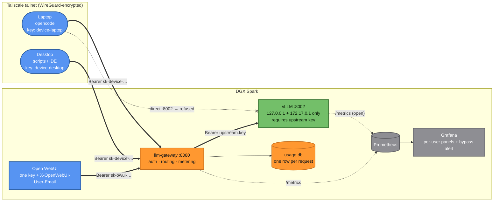

# Metering Gateway & Tailscale Integration

The gateway sits between every client and vLLM. It attributes each request to a user or device
and counts its tokens in real time. It also makes sure nothing can reach the model without
going through it. With Tailscale, every laptop and desktop on your tailnet can use the model
securely, each with its own key and its own line in Grafana.

- [Why a gateway](#why-a-gateway)
- [Architecture](#architecture)
- [What's in `gateway/`](#whats-in-gateway)
- [Setup, step by step](#setup-step-by-step)
- [Connecting clients](#connecting-clients)
- [Tailscale integration](#tailscale-integration)
- [Monitoring & alerting](#monitoring--alerting)
- [Operations](#operations)
- [Troubleshooting](#troubleshooting)
- [Security notes](#security-notes)

---

## Why a gateway

vLLM's own `/metrics` knows how many tokens it served, but not **who** used them. vLLM also has
no per-user keys. Before the gateway existed on this deployment, 3,308 requests reached the model
in one day and **none** could be attributed to anyone. Open WebUI tracked only its own chats,
while coding agents such as opencode called vLLM directly.

The gateway fixes that in three ways:

| Problem | How the gateway solves it |
|---|---|
| Who used the model? | Every client authenticates with its own API key, mapped to a user, device or app. Open WebUI forwards each end user's email, so one key still attributes usage per person. |
| How much, right now? | Input tokens are counted **when a request starts** (exact count via vLLM `/tokenize`). Output tokens are counted **as they stream** (`continuous_usage_stats`); for non-streaming calls they're counted on completion. |
| Can anyone go around it? | vLLM is published only on localhost and the Docker bridge, and **requires a key that only the gateway holds** (`VLLM_API_KEY`). A direct call gets `401`, even from the same machine. |

## Architecture



**Request lifecycle:**

1. The client sends an OpenAI-style request to `:8080` with `Authorization: Bearer <its key>`.
2. The gateway looks the key up in `keys.json`: no match gives `401`, a match gives
   `{user, client}`. For Open WebUI's key, `user` comes from the forwarded email header instead.
3. The gateway finds which vLLM backend serves `model`. It polls every backend's `/v1/models` every
   10 s, so model swaps need no reconfiguration. If no backend serves it, the client gets `404`
   with the list of available models.
4. It calls vLLM `/tokenize` for the exact prompt size and counts the input immediately.
5. It forwards the request with the **upstream key**. For streaming requests it forces
   `stream_options.include_usage` and `continuous_usage_stats`, then updates the counters on
   every chunk.
6. On completion it reconciles the counters with the final `usage` and writes a row to
   `usage.db` with timestamp, user, client, model, status, token counts, duration and client IP.

## What's in `gateway/`

| File | Purpose |
|---|---|
| `gateway.py` | The service (aiohttp, ~250 lines): auth, routing, metering, `/metrics`, `/health` |
| `setup.sh` | One-shot install: venv, `upstream.key`, admin key, systemd user service, linger |
| `add_key.py` | Issue one key: `add_key.py <user> <client>` |
| `tailscale_keys.py` | Issue one key **per tailnet device** from `tailscale status --json` and write a CSV to hand out |
| `keys.example.json` | Format of `keys.json` |
| `requirements.txt` | `aiohttp`, `prometheus_client` |

Created at runtime and **git-ignored**, never commit these: `keys.json`, `upstream.key`,
`usage.db`, `devices.csv`, `venv/`.

`monitoring/` holds the Prometheus scrape snippet, the Grafana dashboard JSON, and the
provisioned bypass alert.

## Setup, step by step

Assumes vLLM is already set up with this repo ([README → Quick Start](../README.md#quick-start)).

**1. Install the gateway**

```bash
./gateway/setup.sh
# tailnet-only variant (see "Bind the gateway to the tailnet only" below):
GATEWAY_HOST=$(tailscale ip -4) ./gateway/setup.sh
```

This creates `gateway/venv`, a random `gateway/upstream.key`, a `keys.json` holding one admin key
(printed once), and the `llm-gateway` systemd user service on port 8080. It also enables
lingering, so the service starts at boot without a login session. Check it:

```bash
systemctl --user status llm-gateway
curl -s localhost:8080/health          # {"ok": true, "models": [...]}
```

**2. Lock vLLM behind the gateway**

Recreate the vLLM container so that it (a) listens only on localhost and the Docker bridge, and
(b) requires the upstream key:

```bash
VLLM_API_KEY=$(cat gateway/upstream.key) BIND_ADDRS="127.0.0.1 172.17.0.1" ./run.sh
```

- `127.0.0.1` is what the gateway uses. `172.17.0.1`, the Docker bridge, lets a
  Prometheus container still scrape `/metrics`. Neither address is reachable from the LAN or
  the tailnet.
- vLLM reads `VLLM_API_KEY` from the environment, so the key never appears on the command line.
  It only guards `/v1/*`; `/metrics` and `/health` stay open for monitoring.
- This restarts the model (about 4–5 minutes).

**3. Verify the lock**

```bash
curl -s -o /dev/null -w '%{http_code}\n' localhost:8002/v1/models            # 401: no key
curl -s -o /dev/null -w '%{http_code}\n' http://<lan-ip>:8002/v1/models       # 000: port closed
curl -s localhost:8080/v1/models -H "Authorization: Bearer <admin key>"      # 200 via gateway
```

**4. Issue keys**

```bash
cd gateway
venv/bin/python add_key.py alice@example.com opencode       # one person, one app
venv/bin/python tailscale_keys.py                           # one key per tailnet device -> devices.csv
systemctl --user restart llm-gateway                        # load new keys
```

Hand each key to its owner privately. To revoke a key, delete its line from `keys.json` and
restart the gateway.

**5. Point every client at `:8080`** (next section), then **6. wire up monitoring**
([below](#monitoring--alerting)).

## Connecting clients

Every client uses the same three settings:

| Setting | Value |
|---|---|
| Base URL | `http://<server>:8080/v1`, where `<server>` is `127.0.0.1` on the host, the Tailscale IP or MagicDNS name elsewhere |
| API key | the client's own key |
| Model | `qwen3.8-35b-a3b` (or whatever `GET /v1/models` lists) |

**opencode** (`~/.config/opencode/opencode.json`, or `%USERPROFILE%\.config\opencode\opencode.json` on Windows):

```json
{
  "$schema": "https://opencode.ai/config.json",
  "provider": {
    "vllm": {
      "npm": "@ai-sdk/openai-compatible",
      "name": "DGX Spark (metered)",
      "options": { "baseURL": "http://<server>:8080/v1", "apiKey": "<your key>" },
      "models": {
        "qwen3.8-35b-a3b": { "name": "Qwen3.8 35B A3B", "limit": { "context": 262144, "output": 32768 } }
      }
    }
  },
  "model": "vllm/qwen3.8-35b-a3b"
}
```

Restart any running opencode session after changing it, because a live session keeps its old
base URL. For scripted runs, use `opencode run "…" < /dev/null`. Without a terminal on stdin it
waits for input.

**Open WebUI** (per-person attribution through one key):

```ini
# systemd unit / environment
OPENAI_API_BASE_URLS=http://127.0.0.1:8080/v1
OPENAI_API_KEYS=<the key whose keys.json entry has "forwarded_user": true>
ENABLE_FORWARD_USER_INFO_HEADERS=true
```

Open WebUI keeps connection settings in its database once it has started for the first time.
After that, change them in **Admin → Settings → Connections**; the environment variables above
are only read on first start. Give its key `"forwarded_user": true` in `keys.json`, and each
chat is attributed to the logged-in user's email (`X-OpenWebUI-User-Email`).

**Python (OpenAI SDK):**

```python
from openai import OpenAI
client = OpenAI(base_url="http://<server>:8080/v1", api_key="<your key>")
print(client.chat.completions.create(model="qwen3.8-35b-a3b",
      messages=[{"role": "user", "content": "Say OK."}]).choices[0].message.content)
```

**Quick test**, from Linux/macOS or Windows PowerShell:

```bash
curl http://<server>:8080/v1/models -H "Authorization: Bearer <your key>"
```
```powershell
curl.exe http://<server>:8080/v1/models -H "Authorization: Bearer <your key>"
```

## Tailscale integration

[Tailscale](https://tailscale.com) puts every device on a private WireGuard network (a
"tailnet"). It fits well with the gateway:

- **No ports exposed to the internet or the office LAN.** Laptops reach the server from anywhere
  via its `100.x.y.z` address or MagicDNS name, and traffic is end-to-end encrypted by WireGuard.
- **Stable identity per device.** Each device has a fixed Tailscale IP and name. Issuing one gateway
  key per device (`tailscale_keys.py`) makes Grafana show usage **per device**, and the gateway
  records each request's source IP, so a key used from the wrong device stands out.

### 1. Join the server and clients to the tailnet

```bash
# server (Linux)
curl -fsSL https://tailscale.com/install.sh | sh
sudo tailscale up
tailscale ip -4                  # e.g. 100.x.y.z; clients use this (or the MagicDNS name)
```

On each laptop or desktop, install Tailscale (macOS, Windows, Linux) and sign in to the same
tailnet. Check that it can reach the gateway:

```bash
curl http://<server-tailscale-ip>:8080/health
# with MagicDNS enabled you can use the machine name instead:
curl http://<server-name>:8080/health
```

### 2. Issue one key per device

```bash
cd gateway
venv/bin/python tailscale_keys.py            # every peer except this server, online or offline
venv/bin/python tailscale_keys.py --online-only
systemctl --user restart llm-gateway
```

This reads `tailscale status --json` and adds a `device-<name>` key for each peer that doesn't
have one yet. Re-running it only adds keys for new devices. It writes `gateway/devices.csv`
(`device, tailscale_ip, api_key`, mode 600, git-ignored) for handing keys out. If your
`tailscale` binary isn't on `PATH`, pass `--tailscale /path/to/tailscale`.

If several people share one Tailscale login, device names are the only identity Tailscale can
provide, which is why keys are labelled by device. To label by person instead, edit `user` in
`keys.json`, or issue keys with `add_key.py <email> <client>`.

### 3. Bind the gateway to the tailnet only (optional)

By default the gateway listens on every interface (`0.0.0.0:8080`), so the office LAN can reach
it too. It still needs a key. To accept connections only from the tailnet:

```bash
GATEWAY_HOST=$(tailscale ip -4) ./gateway/setup.sh
```

Local clients on the server, such as Open WebUI, must then use `http://<server-tailscale-ip>:8080/v1`
rather than `127.0.0.1`.

### 4. HTTPS with a real certificate (optional)

Tailscale can put a trusted HTTPS endpoint in front of the gateway on your tailnet domain. Enable
**HTTPS certificates** in the Tailscale admin console (DNS page), then:

```bash
sudo tailscale serve --bg http://127.0.0.1:8080     # https://<server-name>.<tailnet>.ts.net/
tailscale serve status
```

Clients can then use `https://<server-name>.<tailnet>.ts.net/v1`. Check `tailscale serve --help`
for your version's exact flags. Requests arriving through `tailscale serve` come from
`127.0.0.1`, so the per-request IP in `usage.db` will show the proxy, not the device. Attribution
by key is unaffected.

### 5. Restrict who can reach the gateway (optional)

With a [tailnet policy file](https://tailscale.com/kb/1018/acls) you can allow only some users or
devices to reach port 8080 on the server:

```jsonc
{
  "tagOwners": { "tag:llm-server": ["autogroup:admin"] },
  "groups":    { "group:llm-users": ["alice@example.com", "bob@example.com"] },
  "acls": [
    { "action": "accept", "src": ["group:llm-users"], "dst": ["tag:llm-server:8080"] }
    // ...your other rules
  ]
}
```

Tag the server with `sudo tailscale up --advertise-tags=tag:llm-server`. This works alongside
the gateway keys: Tailscale decides who can *connect*, and the gateway decides who is *counted*.

### 6. Cross-check keys against devices

Each request row stores the source IP. This lists which IPs each key was used from:

```bash
cd gateway && venv/bin/python - <<'EOF'
import sqlite3
for row in sqlite3.connect("usage.db").execute("""
    SELECT client, client_ip, COUNT(*), SUM(input_tokens), SUM(output_tokens)
    FROM requests WHERE client_ip IS NOT NULL GROUP BY 1, 2 ORDER BY 1"""):
    print(row)
EOF
```

A `device-*` key showing an IP other than that device's Tailscale IP has been copied to another
machine. Revoke it and issue a new one.

## Monitoring & alerting

**Prometheus**: add both jobs from [`monitoring/prometheus-scrape.yml`](../monitoring/prometheus-scrape.yml):

```yaml
  - job_name: vllm
    static_configs: [{targets: ["host.docker.internal:8002"]}]
  - job_name: llm-gateway
    static_configs: [{targets: ["host.docker.internal:8080"]}]
```

If `prometheus.yml` is bind-mounted as a single file, run `docker restart <prometheus>` after
editing it. A SIGHUP won't see a file replaced by `sed -i`.

**Metrics the gateway exposes** (`:8080/metrics`):

| Metric | Labels | Meaning |
|---|---|---|
| `llm_user_tokens_total` | `user, client, model, type=input\|output` | Tokens, updated live |
| `llm_user_requests_total` | `user, client, model, status` | Requests by outcome |
| `llm_request_duration_seconds` | `client, model` | End-to-end latency histogram |

Counters are re-seeded from `usage.db` at startup, so totals survive restarts.

**Grafana dashboard**: import [`monitoring/grafana-dashboard.json`](../monitoring/grafana-dashboard.json)
("vLLM Command Center"). Its **Per-User Usage (current model)** section has:

- Current Model, Users Tracked, User Tokens (input + output), Top User
- Per-User Token Usage Over Time, Tokens by Client
- Per-User Token Usage table (user, client, model, requests, total tokens)
- **Direct-to-vLLM Requests (unmetered)**, **Metered Requests**, **Gateway Coverage %**

Every per-user query is filtered to the model vLLM is serving right now: it joins the gateway's
`model` label with vLLM's `model_name`. So after a swap the panels switch to the new model's
users automatically.

**Bypass alert**: copy [`monitoring/gateway-bypass-alert.yml`](../monitoring/gateway-bypass-alert.yml)
into Grafana's `provisioning/alerting/` and restart Grafana. It fires when, over 30 minutes, vLLM
finished more than 20 requests that the gateway didn't send (20 is above the 16 that can be in
flight at once). It compares **requests**, not tokens: long non-streaming requests would make
a token-based comparison fire falsely. To get notified, add a contact point (email, Slack, …)
under Alerting.

## Operations

| Task | How |
|---|---|
| Add a person/app | `venv/bin/python add_key.py <user> <client>` → `systemctl --user restart llm-gateway` |
| Add new tailnet devices | `venv/bin/python tailscale_keys.py` → restart |
| Revoke a key | delete its entry from `keys.json` → restart |
| Rotate the upstream key | write a new `upstream.key`, restart the gateway, recreate vLLM with the new `VLLM_API_KEY` |
| Swap models | nothing to do: backends are polled, and requests route by `model` |
| Usage report | query `usage.db` (below) |
| Logs | `journalctl --user -u llm-gateway -f` |

Restarting the gateway drops requests in flight. Check `vllm:num_requests_running` first if
long agent calls are running.

**Usage by user and day:**

```sql
SELECT date(ts, 'unixepoch', 'localtime') AS day, user, client,
       COUNT(*) AS requests, SUM(input_tokens) AS input, SUM(output_tokens) AS output
FROM requests WHERE status = 'ok'
GROUP BY 1, 2, 3 ORDER BY 1 DESC, 5 DESC;
```

**Request statuses:** `ok`, `http_<code>` (vLLM returned an error), `no_backend` (requested model
not being served), `upstream_error` (vLLM unreachable, e.g. mid-restart), `client_disconnect`
(the client hung up mid-stream; not a server fault).

## Troubleshooting

| Symptom | Cause / fix |
|---|---|
| Client gets `401 invalid API key` | Wrong or revoked key, or the gateway wasn't restarted after adding it. |
| Client gets `404 model '…' is not being served` | That model isn't loaded. `GET /v1/models` lists what is. |
| Direct `:8002` call gets `401` or is refused | Working as intended. Use `:8080`. |
| Grafana per-user numbers lag behind vLLM's | Non-streaming requests report output tokens only when they finish (input is counted at start). Long agent calls can take minutes. |
| Bypass alert *pending* right after setup | The 30-minute window still includes traffic from before the lock. It clears on its own. |
| A burst of `upstream_error` rows | vLLM was restarting. Clients retried against a down backend. |
| opencode on the host hangs in scripts | Run with `< /dev/null`. |
| Tailscale device can't connect | `tailscale status` on both ends. If `GATEWAY_HOST` is the Tailscale IP, LAN addresses won't work. |

## Security notes

- `keys.json`, `upstream.key`, `usage.db` and `devices.csv` are created with mode 600 and are
  git-ignored. Never commit or paste them.
- Treat the **upstream key** like root access to the model: anyone holding it can bypass
  metering. It's only needed by the gateway and the vLLM container environment.
- The gateway speaks plain HTTP. Over Tailscale that's encrypted by WireGuard. On a LAN it's
  not, so prefer the tailnet, `tailscale serve` HTTPS, or `GATEWAY_HOST=<tailscale-ip>`.
- vLLM's `/metrics` is unauthenticated but only published on `127.0.0.1` and the Docker bridge.
- The gateway stores the client IP and user label for each request. Tell your users that usage
  is logged per key.
